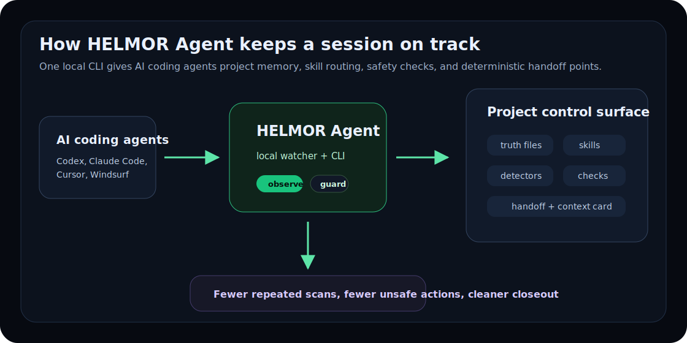
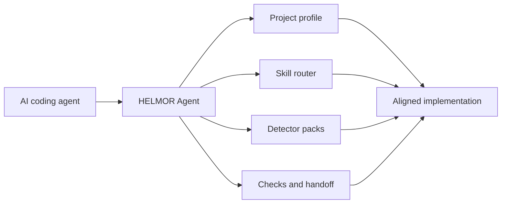
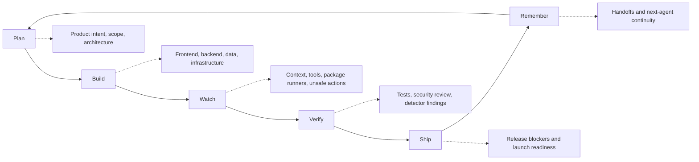
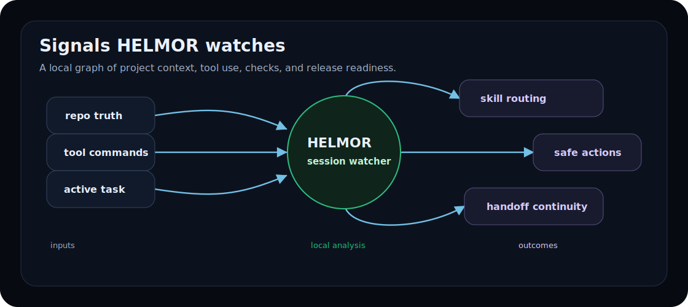

<p align="center">
  
</p>

<div align="center">

<h1>HELMOR Agent</h1>

<p><strong>The local agent watcher that keeps AI-assisted product development aligned, safer, and easier to hand off.</strong></p>

<p>HELMOR gives Codex, Claude Code, Cursor, Windsurf, and other AI coding agents a project-aware control layer for context, 140+ skill routing, detector checks, and release discipline.</p>

<a href="https://github.com/helmorx/agent-os/actions/workflows/ci.yml"></a>
<a href="https://www.npmjs.com/package/@helmoragent/helmor"></a>
<a href="https://www.npmjs.com/package/@helmoragent/helmor"></a>
<a href="https://github.com/helmorx/agent-os/releases"></a>
<a href="https://github.com/helmorx/agent-os/blob/main/LICENSE"></a>

<br>

<a href="#install"><b>Install</b></a> |
<a href="#quickstart"><b>Quickstart</b></a> |
<a href="#how-it-works"><b>How it works</b></a> |
<a href="#lifecycle-graph"><b>Lifecycle</b></a> |
<a href="#docs"><b>Docs</b></a> |
<a href="https://helmor.io"><b>Website</b></a> |
<a href="https://x.com/helmorlabs"><b>X</b></a>

</div>

<table>
  <tr>
    <td width="20%" align="center"><strong>89% token savings</strong><br>target</td>
    <td width="20%" align="center"><strong>95% less hallucinations</strong><br>target</td>
    <td width="20%" align="center"><strong>Zero drift</strong><br>truth-file alignment</td>
    <td width="20%" align="center"><strong>140+ skills</strong><br>agent routing library</td>
    <td width="20%" align="center"><strong>Guardrails</strong><br>best-in-class UI/UX and safety review</td>
  </tr>
</table>

---

## Install

| Platform | Command |
|---|---|
| npm | `npm i -g @helmoragent/helmor` |
| one-off npm | `npx @helmoragent/helmor@latest install` |
| pnpm | `pnpm dlx @helmoragent/helmor install` |
| yarn | `yarn dlx @helmoragent/helmor install` |
| bun | `bunx @helmoragent/helmor install` |
| macOS Homebrew | `brew install helmorx/tap/helmoragent` |
| Windows PowerShell | <code>irm https://raw.githubusercontent.com/helmorx/agent-os/main/install/install.ps1 &#124; iex</code> |
| Linux shell | <code>curl -fsSL https://raw.githubusercontent.com/helmorx/agent-os/main/install/install.sh &#124; sh</code> |

## Quickstart

```bash
helmor install
helmor status
helmor dashboard
helmor doctor
```

Existing projects start in `observe` mode, so HELMOR warns, routes, and summarizes before it blocks. Move to `guard` or `strict` when the repo is ready for stronger enforcement.

## Why HELMOR

AI agents are fast, but they waste tokens rediscovering the same repo, forget decisions, invent missing APIs, run the wrong commands, and drift away from product truth. HELMOR sits inside each project as a local agent layer for the whole development lifecycle: fewer repeated context reads, fewer hallucination-prone turns, stronger UI/UX review discipline, and safety guardrails before handoff or release.

<table>
  <tr>
    <td width="25%">
      <h3>Context</h3>
      <p>Start sessions with compact repo state, project profile, and handoff context.</p>
    </td>
    <td width="25%">
      <h3>Routing</h3>
      <p>Send prompts toward the right built-in skill before an agent spends tokens.</p>
    </td>
    <td width="25%">
      <h3>Safety</h3>
      <p>Watch commands, files, package runners, secrets, and release-sensitive paths with configurable guardrails.</p>
    </td>
    <td width="25%">
      <h3>Closeout</h3>
      <p>Track checks, findings, touched areas, handoff notes, and next-agent continuity.</p>
    </td>
  </tr>
</table>

## How It Works

<p align="center">
  
</p>



## Session Dashboard

<p align="center">
  
</p>

## Lifecycle Graph



## Signal Graph

<p align="center">
  
</p>

| Signal | HELMOR watches | Result |
|---|---|---|
| repo truth | docs, project profile, adapters, checks | less drift from the intended product |
| tool use | shell commands, git actions, package runners | earlier warnings or blocks for risky actions |
| project state | active task, touched areas, findings | cleaner handoff and closeout |
| verification | tests, doctor output, detector packs | repeatable pre-release evidence |

## What It Adds To A Project

```text
.helmor/
  project.json          repo profile, checks, policies, tools, adapters
  context-card.md       compact context for new sessions
  handoff.md            closeout summary for the next agent
  state.json            local runtime state, ignored by git
```

HELMOR is local-first. It does not require an account, upload source, or send telemetry in v1.

## Agent Support

| Agent | V1 support | Integration style |
|---|---:|---|
| Codex | yes | hook-compatible command entrypoints |
| Claude Code | yes | hook-compatible command entrypoints |
| Cursor | yes | generated project rules |
| Windsurf | yes | generated project rules |
| Other agents | compatible | `helmor hook --event <EventName>` |

## Modes

| Mode | Use it when | Behavior |
|---|---|---|
| `observe` | adopting HELMOR in an existing repo | warn, route, summarize |
| `guard` | active development with agents | block secrets, destructive git, wrong runner, unsafe deploys |
| `strict` | release, launch, security-sensitive work | enforce checks, handoffs, closeout, security review |

## HELMOR Skills

HELMOR ships with 140+ built-in skills that route AI coding agents toward the right behavior before they spend tokens or touch code.

| Lifecycle | Skills |
|---|---|
| Plan | Product Planning, Architecture, API Contracts |
| Build | Frontend, Backend, Data, Infrastructure, UI Design |
| Verify | Testing, Security, Launch Readiness |
| Remember | Project Memory, Token Reduction, Docs & Handoff |

## Docs

| Topic | Link |
|---|---|
| Quickstart | [docs/QUICKSTART.md](docs/QUICKSTART.md) |
| Skills | [docs/SKILLS.md](docs/SKILLS.md) |
| Commands | [docs/COMMANDS.md](docs/COMMANDS.md) |
| Agent adapters | [docs/ADAPTERS.md](docs/ADAPTERS.md) |
| Detector packs | [docs/DETECTORS.md](docs/DETECTORS.md) |
| Project profile | [docs/PROJECT_PROFILE.md](docs/PROJECT_PROFILE.md) |
| Security policy | [SECURITY.md](SECURITY.md) |
| Contributing | [CONTRIBUTING.md](CONTRIBUTING.md) |
| Changelog | [CHANGELOG.md](CHANGELOG.md) |

## Built For

- developers building new products with AI agents
- vibe coders who need less hallucination and more structure
- teams that want repeatable AI-assisted development workflows
- projects that need context, testing, handoff, and launch discipline

## License

Apache-2.0. See [LICENSE](LICENSE).
