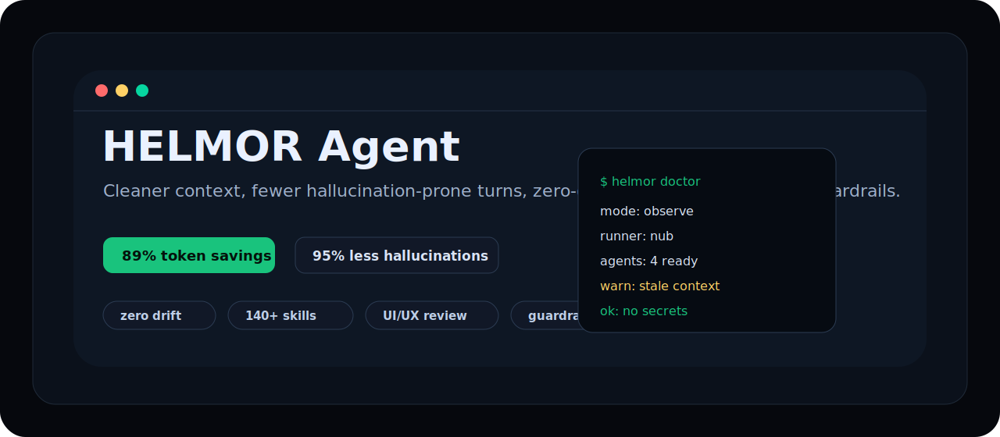
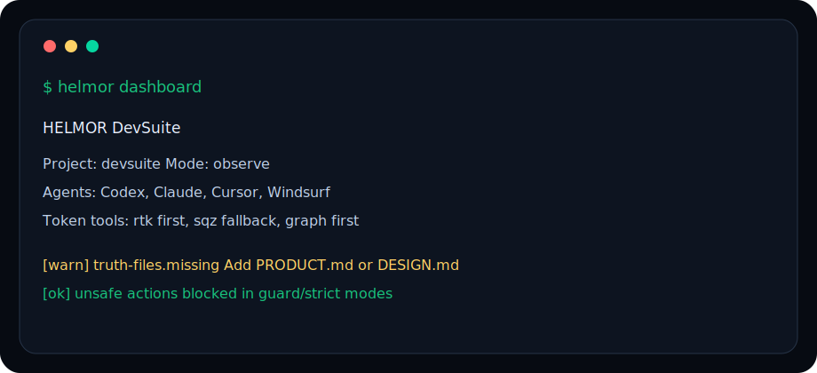

<p align="center">
  
</p>

<p align="center">
  <a href="https://github.com/helmorx/agent-os/actions/workflows/ci.yml"></a>
  <a href="https://github.com/helmorx/agent-os/releases"></a>
  <a href="https://github.com/helmorx/agent-os/blob/main/LICENSE"></a>
  <a href="#install"></a>
</p>

<h1 align="center">HELMOR Agent OS</h1>

<p align="center">
  The local agent watcher that helps developers build products from idea to launch.
</p>

<p align="center">
  HELMOR gives Codex, Claude Code, Cursor, Windsurf, and other AI coding agents a project-aware devsuite that watches sessions, routes 14 skills, preserves context, cuts token waste, reduces drift, and enforces checks before handoff or release.
</p>

<p align="center">
  <a href="#install"><b>Install</b></a>
  ·
  <a href="#quickstart"><b>Quickstart</b></a>
  ·
  <a href="#helmor-skills"><b>Skills</b></a>
  ·
  <a href="#watcher-layer"><b>Watcher</b></a>
  ·
  <a href="#docs"><b>Docs</b></a>
  ·
  <a href="https://helmor.io"><b>Website</b></a>
  ·
  <a href="https://x.com/helmorlabs"><b>X</b></a>
</p>

---

## Why HELMOR

AI agents are fast, but they waste tokens rediscovering the same repo, forget decisions, invent missing APIs, run the wrong commands, and drift away from product truth. HELMOR sits inside each project as a local operating layer for the whole development lifecycle.

<table>
  <tr>
    <td width="33%">
      <h3>Build end to end</h3>
      <p>Guide work from product planning to implementation, testing, handoff, and launch readiness.</p>
    </td>
    <td width="33%">
      <h3>Spend fewer tokens</h3>
      <p>Prefer compact output, repo context cards, handoffs, graph-first discovery, RTK, and SQZ fallback.</p>
    </td>
    <td width="33%">
      <h3>Reduce drift</h3>
      <p>Keep agents aligned to truth files, package runners, checks, policies, skills, and local task state.</p>
    </td>
  </tr>
</table>

## Install

Node.js:

```bash
npm i -g @helmoragent/helmor
```

One-off:

```bash
npx @helmoragent/helmor@latest install
pnpm dlx @helmoragent/helmor install
yarn dlx @helmoragent/helmor install
bunx @helmoragent/helmor install
```

macOS Homebrew:

```bash
brew install helmorx/tap/helmoragent
```

Windows:

```powershell
irm https://raw.githubusercontent.com/helmorx/agent-os/main/install/install.ps1 | iex
```

Linux:

```bash
curl -fsSL https://raw.githubusercontent.com/helmorx/agent-os/main/install/install.sh | sh
```

## Quickstart

```bash
helmor install
helmor status
helmor dashboard
helmor doctor
```

Existing projects start in `observe` mode, so HELMOR warns, routes, and summarizes before it blocks. Move to `guard` or `strict` when the repo is ready for stronger enforcement.

## Product Lifecycle

| Stage | What HELMOR keeps stable |
|---|---|
| Plan | product intent, scope, architecture, API contracts |
| Build | frontend, backend, data, infrastructure, and UI decisions |
| Watch | session context, tool use, package runners, unsafe actions |
| Verify | tests, checks, security review, detector findings |
| Ship | release blockers, launch readiness, production approval |
| Remember | handoffs, context cards, decisions, next-agent continuity |

## HELMOR Skills

HELMOR ships with 14 built-in skills that route AI coding agents toward the right behavior before they spend tokens or touch code.

| Lifecycle | Skills |
|---|---|
| Plan | Product Planning, Architecture, API Contracts |
| Build | Frontend, Backend, Data, Infrastructure, UI Design |
| Verify | Testing, Security, Launch Readiness |
| Remember | Project Memory, Token Reduction, Docs & Handoff |

## Watcher Layer

The watcher is the part of HELMOR that stays with the agent session:

- starts sessions with compact repo context
- routes prompts to the right HELMOR skills
- watches tool use for risky or drifty actions
- blocks secrets, destructive git, runner bypass, and unsafe deploy paths when configured
- tracks touched areas, pending checks, and closeout state
- preserves handoffs before compaction, stop, or session end

<p align="center">
  
</p>

## What It Adds To A Project

```text
.helmor/
  project.json          repo profile, checks, policies, tools, adapters
  context-card.md       compact context for new sessions
  handoff.md            closeout summary for the next agent
  state.json            local runtime state, ignored by git
```

HELMOR is local-first. It does not require an account, upload source, or send telemetry in v1.

## Agent Support

| Agent | V1 support | Integration style |
|---|---:|---|
| Codex | yes | hook-compatible command entrypoints |
| Claude Code | yes | hook-compatible command entrypoints |
| Cursor | yes | generated project rules |
| Windsurf | yes | generated project rules |
| Other agents | compatible | `helmor hook --event <EventName>` |

## Modes

| Mode | Use it when | Behavior |
|---|---|---|
| `observe` | adopting HELMOR in an existing repo | warn, route, summarize |
| `guard` | active development with agents | block secrets, destructive git, wrong runner, unsafe deploys |
| `strict` | release, launch, security-sensitive work | enforce checks, handoffs, closeout, security review |

## Docs

- [Quickstart](docs/QUICKSTART.md)
- [Skills](docs/SKILLS.md)
- [Commands](docs/COMMANDS.md)
- [Agent adapters](docs/ADAPTERS.md)
- [Detector packs](docs/DETECTORS.md)
- [Project profile](docs/PROJECT_PROFILE.md)
- [Security policy](SECURITY.md)
- [Contributing](CONTRIBUTING.md)
- [Changelog](CHANGELOG.md)

## Built For

- developers building new products with AI agents
- vibe coders who need less hallucination and more structure
- teams that want repeatable AI-assisted development workflows
- projects that need context, testing, handoff, and launch discipline

## License

Apache-2.0. See [LICENSE](LICENSE).
